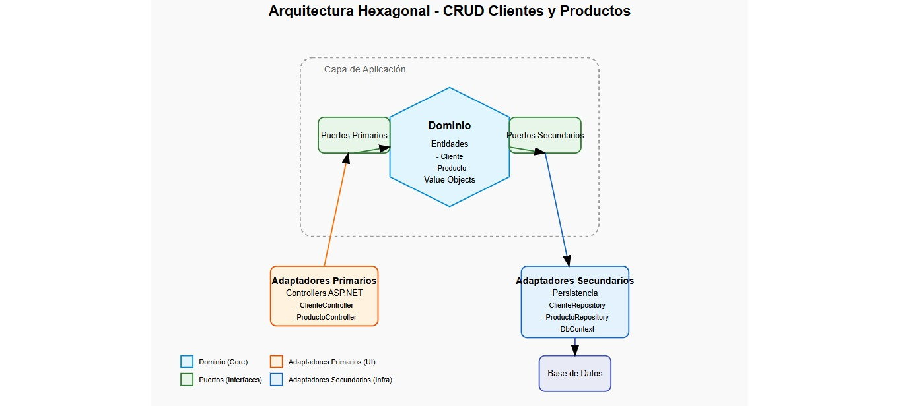
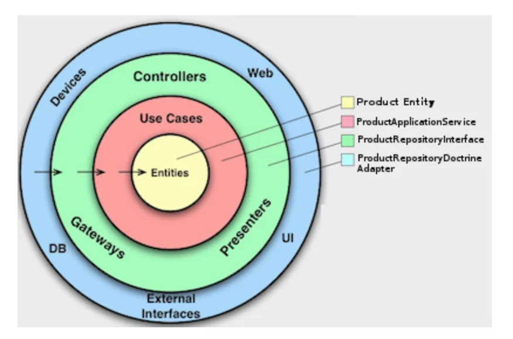

# 📘 USPG CRUD Libros - Segundo Parcial Ingeniería de Software

Este es un proyecto académico desarrollado como parte del **Segundo Parcial** del curso de **Ingeniería de Software**. Se trata de una aplicación web construida con **Astro** utilizando el enfoque de **Arquitectura Limpia (Clean Architecture)** y conectada a una base de datos en **Supabase**. El objetivo es demostrar buenas prácticas de desarrollo de software, separación de responsabilidades y una estructura escalable.

---

## 🚀 Tecnologías Utilizadas

- **Astro**: Framework moderno para construir sitios rápidos con componentes.
- **TypeScript**: Tipado estático para mayor robustez.
- **Tailwind CSS**: Estilos rápidos y reutilizables.
- **Supabase**: Backend as a Service con base de datos PostgreSQL y autenticación.
- **Clean Architecture**: Organización por capas para mantener separación de responsabilidades.

---

## 🧱 Estructura del Proyecto

La estructura sigue el principio de **Arquitectura Hexagonal**, también conocida como **Clean Architecture**, dividiendo el proyecto en capas bien definidas.

```
src/
├── features/
│   ├── libros/
│   │   ├── adapters/
│   │   │   ├── in/rest/              → Controladores HTTP
│   │   │   └── out/db/               → Repositorios conectados a Supabase
│   │   ├── application/             → Casos de uso (Create, Update, Delete)
│   │   ├── domain/models/           → Entidades de dominio (Libro)
│   │   └── ports/                   → Puertos (Interfaces)
│   └── Autores/                     → Módulo extra para manejo de autores (WIP)
│
├── pages/
│   ├── libros/                      → Vistas Astro (formulario, listado, etc)
│   └── api/libros/                 → Endpoints API (POST, PUT, DELETE)
│
├── shared/database/supabase.ts     → Configuración global de Supabase
├── styles/global.css               → Estilos base con Tailwind
```

---

## 📄 Funcionalidades

- 🔐 Login (implementado previamente)
- 📚 Crear nuevo libro
- 📝 Editar libro existente
- ❌ Eliminar libro con confirmación
- 📄 Ver listado de libros
- 📦 Manejo de base de datos con Supabase
- ✅ Integración con políticas de seguridad (RLS en Supabase)
- 📦 Separación por capas: UI, Casos de uso, Repositorios

---

## 🛠️ Instalación y Ejecución

```bash
# Clonar repositorio
git clone git@github.com:fLeonel/hexagonal_architecture.git

# Instalar dependencias
npm install

# Levantar el proyecto
npm run dev
```

> 📌 Asegúrate de tener configuradas tus variables de entorno con tu proyecto de Supabase en `supabase.ts`.

---

## 🌐 Rutas Principales

| Ruta               | Descripción                    |
| ------------------ | ------------------------------ |
| `/libros`          | Formulario para crear libro    |
| `/libros/listado`  | Tabla con todos los libros     |
| `/api/libros`      | Endpoint POST para crear libro |
| `/api/libros/[id]` | Endpoints DELETE y PUT por ID  |

---

## 👨‍🏫 Equipo de Trabajo

Proyecto realizado por estudiantes de **Ingeniería de Software - UVG**  
Cada estudiante tiene su propio archivo `md` en `features/Autores/adapters/` como evidencia de contribución.

---

## 📅 Evaluación

- [x] Aplicación funcional con CRUD
- [x] Separación de capas (Clean Architecture)
- [x] Documentación clara y estructura organizada
- [x] Buen uso de herramientas modernas (Astro, Supabase, Tailwind)

---

## 📌 Notas

> Este proyecto sirve como punto de partida para extender funcionalidades como autenticación por usuario, manejo de stock o dashboards administrativos.

---

## 🧠 Inspiración

Inspirado en principios de arquitectura de software de Robert C. Martin (Uncle Bob), usando un enfoque **Domain-Driven** y **hexagonal** para un aprendizaje práctico en desarrollo moderno.

---
## 😎 Proyecto Adicional
Se realizo en paralelo un desarrollo del mismo CRUD en el cual se interiorizo el funcionamiento y la implementacion de `Hexagonal Architecture`, a cargo de **Luis Reyes**.
[Ver proyecto](https://github.com/LuisAlfred1/HexagonalCrudNet.git)

--- 

## 👥 Colaboradores

1. Dennis Ramirez - 1800595
2. Harleth Garcia 1900348
3. Luis Reyes - 2300319
4. Walter Mijangos 2300273
5. Angel Flores 2300096

## 📸 Diagramas



